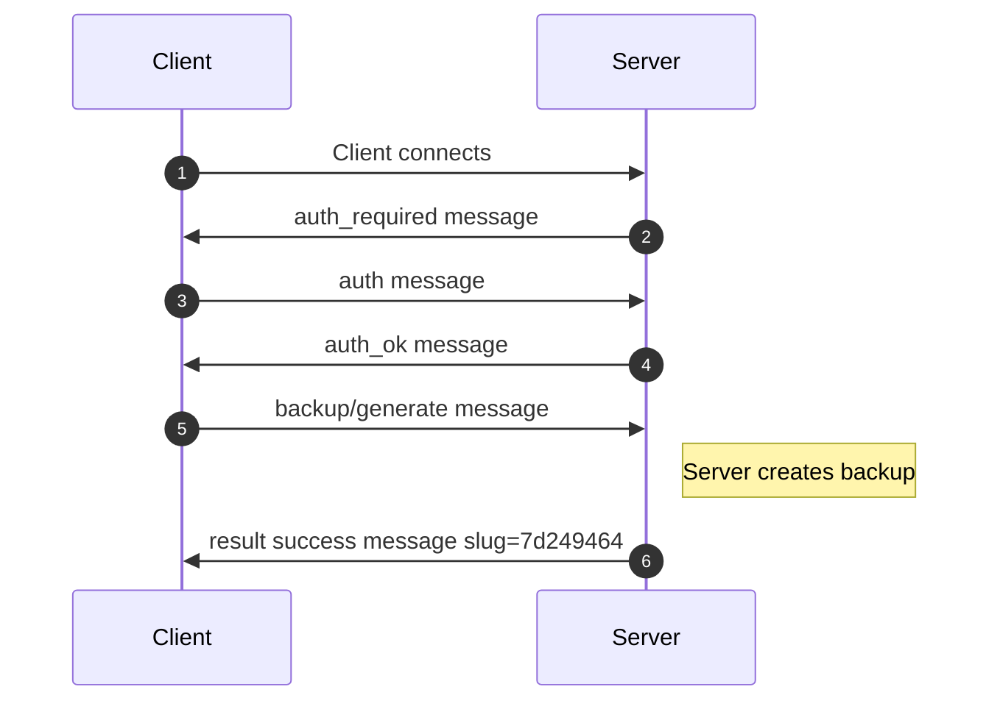
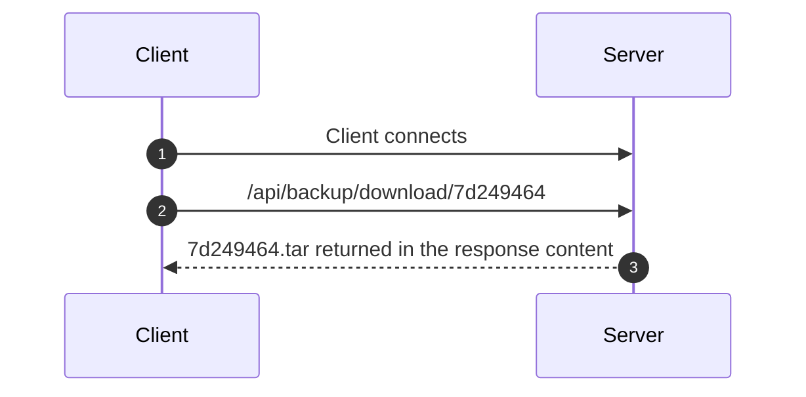

## Rationale

Home Assistant provides a REST API, but,
1. It only provides an API for "Download backup file <12345>"
2. There is no API to create a new backup
3. There is no way to find out the magic hash number for existing backups that have been created previously and are ready for download

Home Assistant also has a websocket API that it seems to use internally when you are using the regular web interface. It is a bit more complicated than the regular API, but more powerful.

## Data Flow

### 1. Create a Backup with the WebSocket API

https://developers.home-assistant.io/docs/api/websocket/



### 2. Download the Backup with the REST API

https://developers.home-assistant.io/docs/api/rest




## Curl WebSocket Support

> The WebSocket API was introduced as experimental in 7.86.0 and is still experimental today.

> It is only built-in if explicitly opted in at build time. We discourage use of the WebSocket API in production because of its experimental state. We might change API, ABI and behavior before this "goes live". 

## Requirements

- [libjson-c](https://github.com/json-c/json-c)

## Build

Install dependencies:

Ubuntu:
```bash
sudo apt install gcc-c++ cmake json-c-dev gtest-dev
```

Fedora:
```bash
sudo dnf install gcc-c++ cmake json-c-devel gtest-devel
```

Build:
```bash
$ (cd libcurl && ./build.sh)
$ cmake .
$ make -j 4
```

## Run the Unit Tests

```bash
$ ./unit_tests
```

## Usage

1. Create an API token in Home Assistant under "Long-lived access tokens" in your profile
2. Optionally, if your Home Assistant instance is using self signed certificates then you will need to get a copy of the public key, saved to something like `myserver.network.home.crt`.
3. Create a copy of the `configuration.json.example` with the name `configuration.json` and modify it with your settings, leave the certificate path blank or delete the field if you are not using self signed certificates:
```json
{
  "settings": {
    "api_token": "ABCDEFGHIJKLMNOPQ",
    "self_signed_certificate": "./myserver.network.home.crt",
    "host_name": "myserver.network.home",
    "port": 8443
  }
}
```
4. Create and download a backup (It will be written to something like backup20230125.df73b3a4.tar):
```bash
./homeassistant-websocket-api-helper --create-and-download-backup
```
